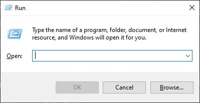
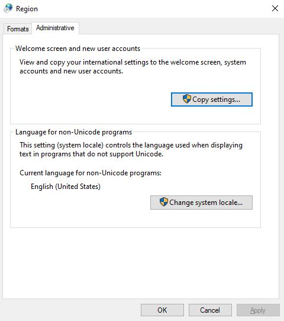

# lspp
`lspp` (ls++) is an improved form of the `ls` command that lists files in a tree-style structure.  


## Table of Contents

---
* [Installation](#installation)
  * [Prerequisites](#prerequisites)
  * [On Windows](#windows)
  * [On Linux or macOS](#linux-or-macOS)
* [Usage](#usage)
* [Troubleshooting](#troubleshooting)
  * [On Windows](#troubleshooting-on-windows)
    * [Executing `install.ps1`](#powershell-script-execution)
    * [Charsets displaying as gibberish](#gibberish-charsets)
  * [On Linux or macOS](#troubleshooting-on-linux-or-macos)
    * [Executing `install.sh`](#shell-script-execution)
* [License](#license)

## Installation

---
[Back to top](#table-of-contents)
> ### Prerequisites
> The following tools need to be installed on your computer to build `lspp` from source.
> * Maven 3.9.6+
> * GraalVM JDK 21+

### Windows
Run the `install.ps1` script in a powershell instance. If running the installation script doesn't work, refer to the
[Windows troubleshooting](#troubleshooting-on-windows) section of this README.

### Linux or macOS
Run the `install.sh` shell script in a terminal instance. Afterward, to add `lspp` to your path, add the following line
to your `~/.bashrc` or `~/.bash_profile` file:
```shell
export PATH="/<path>/<to>/<lspp>/<parent>:$PATH";
```
Where `/<path>/<to>/<lspp>/<parent>` is the path to the parent directory of the `lspp` executable. If running the
installation script doesn't work, refer to the [Linux/macOS troubleshooting](#troubleshooting-on-linux-or-macos) section of this README.

## Usage

---
[Back to top](#table-of-contents)

To run `lspp`, type `lspp` in the terminal after installation. `lspp` takes in a variety of arguments to extend its
functionality.

```
Usage: lspp [-hv] [-a=<regex>] [-c=<charset>] [-d=<depth>] [-s=<fileName>] DIRECTORY
Lists the files in a folder in a tree-style output

Written by Kedar Panchal

DIRECTORY                    The directory to list files in. If none is specified, then the
                             the current working directory's contents are listed.
-s, --search=<filename>      The name of the file to search for. Only the file and its parent
                             directories will be displayed.
-a, --search-all=<filename>  Searches for all files that match the specified regex and lists a
                             file tree containing only those files.
-c, --charset=<charset>      The charset to use when displaying the file tree (default: ASCII).
                             Valid values (case-insensitive): BOX, ROUND, TUBE, ASCII.
-v, --version                Outputs the version of the program.
-h, --help                   Displays this message.
-d, --depth=<depth>          The depth of the files to list in a tree.
```

## Troubleshooting

---
[Back to top](#table-of-contents)
> ### Note on building lspp
> For `lspp` to be built as an executable, Maven requires that your environment's `JAVA_HOME` variable be set
> to your GraalVM installation path. If `install.ps1` or `install.sh` exit early due to the `JAVA_HOME` variable not
> being configured correctly, ensure that the `JAVA_HOME` variable is set to your GraalVM installation location.

### Troubleshooting on Windows

#### Powershell script execution
If you can't run the `install.ps1` script in a PowerShell instance, check your user's execution policy by running:
```powershell
Get-ExecutionPolicy -Scope UserProfile
``` 
If the output of the command is not `Unrestricted` or `Bypass`, run:
```powershell
Set-ExecutionPolicy -ExecutionPolicy Unrestricted -Scope UserProfile
```
This enables the current user to run `.ps1` scripts in PowerShell.

#### Gibberish Charsets
By default, Windows Command Prompt (and other Windows terminals) do not use `UTF-8` encoding by default. This means that
when passing any `--charset` argument into `lspp` except for `ASCII`, the file tree is often outputted as
near-incomprehensible gibberish. To fix this, you need to set the system locale to `UTF-8`. Currently, this feature is
in beta and may impact other aspects of your computer.

To set the system locale to `UTF-8`, follow the following steps:
1. Press `Win` + `R` on your keyboard to open the Run command.
   
    
2. Type `intl.cpl` and click the `OK` button to open the regional settings in Control Panel.  
3. Navigate to the `Administrative` tab and click the `Change system locale...` button.  

    
4. Check the `Beta: Use Unicode UTF-8 for worldwide language support` checkbox.  

    
5. Press the `OK` button and reboot.
### Troubleshooting on Linux or macOS

#### Shell script execution
If you can't run the `install.sh` script on your Linux or macOS machine, ensure it has executable permissions by
running:
```shell
chmod +x install.sh
```
## License

---
[Back to top](#table-of-contents)
The BSD 3-Clause License (BSD-3) 2024 - [Kedar Panchal](https://github.com/KedarPanchal). Please look at the
[LICENSE](LICENSE) for further information.
